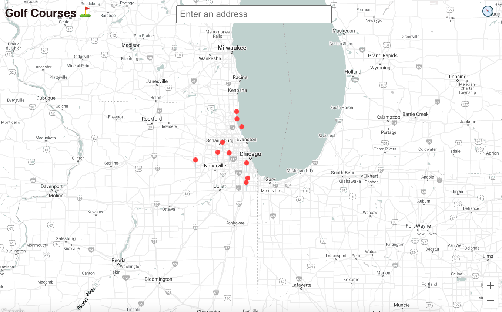

# Find Good Golf

A ReactJS app integrated with the Google Maps API to display the top 10 courses in the Chicagoland area

### Map

### Google Maps API

The project requires an API Key from Google and the following
Google Maps APIs to be enabled:
- Geocoding API
- Maps Javascript API
- Places API

### Tutorial

I used [this tutorial](https://www.youtube.com/watch?v=WZcxJGmLbSo) to help me start my project.

## Author
Jonathan Nocek - *jnocek@iwu.edu*